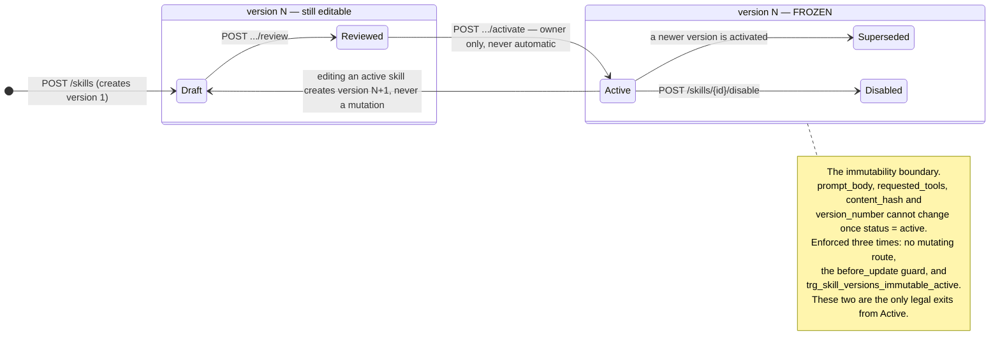

# Architecture decisions

Short notes on the choices that shaped this service, and what each one costs.

---

## The lifecycle at a glance

Where the immutability boundary sits is the whole design, so it is worth one
picture. Everything left of the dashed line can still change; everything right
of it is frozen and can only be superseded.



At most one version per skill may sit in `Active` at a time — that is not a
convention the service maintains, it is
`uq_skill_versions_one_active_per_skill`, a partial unique index the database
enforces. Activation of a different version supersedes the incumbent and
promotes the successor inside a single transaction, serialised by a row lock on
the skill.

---

## Why PostgreSQL

The invariants this system exists to protect are *data* invariants, not
application invariants:

* at most one active version per skill,
* an active version's content never changes,
* the audit log only ever grows.

Postgres can enforce all three itself — partial unique indexes, `BEFORE UPDATE`
triggers, table-level privilege revocation — so they survive a bug in the
service, a migration script, an operator with `psql`, or a second service added
later by a different team. A guarantee that lives only in application code is a
convention; a guarantee that lives in the database is a constraint.

It also gives us JSONB for `requested_tools` and `payload` (schemaless where the
shape genuinely varies, typed everywhere else), real transactions so a state
change and its audit row commit or fail together, and `SELECT … FOR UPDATE` to
serialise version numbering and activation.

**Trade-off.** Logic now lives in two languages, and the PL/pgSQL trigger
duplicates a rule that also exists in Python. Those two can drift. The mitigation
is that `SkillVersion.CONTENT_COLUMNS` names the columns in one place, and
`tests/test_immutability.py` proves the trigger fires by going *around* the ORM
with raw SQL — if the trigger is dropped or weakened, that test fails, not a
production tenant.

---

## Why `organization_id` is the canonical ownership key

Every tenant-owned row carries `organization_id`, including `skill_versions` and
`tool_grants`, where it is denormalised from the parent `skills` row.

That denormalisation is deliberate. If versions were scoped only through their
skill, then *every* version query would need a join to be safe, and the one
query someone writes without the join is the breach. With the column present,
the tenancy predicate is the same single expression on every table, no join
required, and it is trivial to audit: `grep organization_id` finds every place
ownership is asserted.

It also makes the database independently checkable. `SELECT organization_id FROM
skill_versions` answers "who owns this row" without traversing anything, which
matters for the row-level-security policies that would be the production
hardening step (see Known limitations in the README).

The column is never read from client input. `ScopedRepository.add()` overwrites
whatever `organization_id` an object arrives with, and every request schema sets
`extra="forbid"`, so a body containing `organization_id` is a 422 rather than a
silently ignored field.

**Trade-off.** The same fact is stored twice, so a bug could in principle write a
version whose `organization_id` disagrees with its skill's. Three things
constrain that: the repository is the only writer and always stamps the token's
value; the DB trigger refuses to re-parent an active version; and the FK to
`organizations` means the value must at least name a real tenant. A composite
foreign key `(skill_id, organization_id)` referencing a matching unique key on
`skills` would close it completely and is the natural next step.

---

## Why cross-tenant access returns 404, not 403

**403 leaks.** It says "this identifier names a real row, you simply may not have
it." Given a UUID a caller can now distinguish "exists elsewhere" from "does not
exist" — enough to confirm that a competitor is a customer, to probe for
identifiers harvested from a log or a shared screenshot, or to measure another
tenant's activity. The status code becomes an oracle.

So resources outside the caller's organization are not merely forbidden, they are
**invisible**. `ScopedRepository` filters by `organization_id` before the row is
ever fetched, so the service genuinely does not know whether the id exists. The
404 is not a polite fiction; it is the honest answer to the only question that
was asked, which was "does this exist *in my organization*".

This applies to writes and activations too. An owner of XYZ Builders who calls
`POST /skills/{abc-skill}/versions/1/activate` gets 404, never 403 — the role
check is never reached, because the resource never resolves.

**403 is still used, and means something specific:** the caller can see the
resource and the role is insufficient. A *member* of the owning organization who
tries to activate gets 403 `NOT_ORG_OWNER`. Hiding it from them would be a lie —
they can already read it — and would make a legitimate permissions problem
undebuggable.

The ordering is load-bearing and is written the same way in every service method:

```
1. resolve through the scoped repository   → 404 if invisible
2. only then check the caller's role       → 403 if wrong role
3. only then check state                   → 409
```

Reversing steps 1 and 2 would reintroduce exactly the leak this is designed to
prevent. `tests/test_isolation.py::test_cross_org_activation_is_denied_with_404`
pins it.

**Trade-off.** A member of the right organization who fat-fingers a UUID gets a
404 that does not distinguish "typo" from "another tenant's". That is the point,
and the cost is paid in support tickets rather than in disclosure.

---

## Why immutability is defended in three layers

An "active skill silently mutated" is the worst failure this system can have: a
tenant's agent starts behaving differently with no record of why, and the audit
log's version pointer becomes a lie. One layer is not enough, because each layer
has a different bypass.

| Layer | Enforced by | Bypassed by |
|---|---|---|
| 1. API | No route mutates version content; an edit creates version N+1 | Any code that does not go through HTTP |
| 2. Application | `before_update` listener in `app/models/events.py` | Raw SQL, `session.execute()`, another service, `psql` |
| 3. Database | `trg_skill_versions_immutable_active` | Nothing short of dropping the trigger |

Layer 1 makes the right thing the *only* thing an API client can do. Layer 2
catches internal code that holds a mapped object and assigns to it — the mistake
a future contributor is most likely to make — and fails loudly before SQL is
emitted. Layer 3 is the one that actually holds: it applies to raw SQL, to a
background job, to a migration, and to a superuser.

All three agree on one definition of "content": `prompt_body`, `requested_tools`,
`content_hash`, `version_number`, named in `SkillVersion.CONTENT_COLUMNS` and
mirrored in the trigger. Lifecycle metadata is explicitly *not* content — an
active version must still be able to become `superseded` or `disabled`, and only
those two transitions are legal.

The audit log gets the same treatment for the same reason: a `BEFORE UPDATE OR
DELETE` trigger, plus `REVOKE UPDATE, DELETE, TRUNCATE … FROM jarvis_app`. The
REVOKE is why the API connects as a restricted role that does not own the
schema — a table owner would bypass the privilege check entirely, leaving only
the trigger. Both are in place, so tampering fails on privileges for the app and
on the trigger for everyone else, including the owner.

That claim was initially half true, and the gap is worth recording because it is
the kind that hides behind a passing test suite. `TRUNCATE` does not fire *row*
triggers, so `trg_audit_log_append_only` never saw it. The application role could
never truncate — the privilege is revoked — but the schema owner could empty the
table in one statement. Migration `0003` adds `trg_audit_log_no_truncate`, a
statement-level `BEFORE TRUNCATE` trigger, so the guarantee now holds for every
role and every verb. Both the row-level and statement-level cases are tested
(`test_audit.py::test_the_application_role_cannot_truncate_the_audit_log` and
`::test_the_audit_log_cannot_be_truncated_even_by_the_schema_owner`, the latter
on a dedicated owner connection).

The general lesson, which is why it is written down rather than quietly patched:
a database-level guarantee is only as broad as the trigger events it subscribes
to. "The trigger covers it" is not the same claim as "the table cannot change".

**Trade-off.** Three implementations of one rule is duplication, and the DB layer
is invisible in the Python source. It is also the only layer that would have
stopped an incident. `tests/test_immutability.py` tests each layer separately,
including a raw-SQL test per content column, so drift is caught in CI.

---

## Why tool requests are decoupled from tool grants

A skill author says what the skill *wants*. An owner decides what it *gets*.
These are different acts, by different people, at different times, and collapsing
them would mean that anyone who can write a prompt can also widen the blast
radius of the agent that runs it.

So `requested_tools` on a version is an inert list, and `tool_grants` rows are
created with `granted = false` — a default in the model, in the migration and in
the column's `server_default`, so no code path can accidentally create a granted
row. Turning one on is a separate, owner-only, individually audited action.
Runtime selection reads only granted tools, so an ungranted request has no
runtime effect whatsoever.

Requests are validated against an explicit allowlist before they are even
recorded, with two distinct codes: `UNKNOWN_TOOL` for a name that is simply not
on the list, and `FORBIDDEN_TOOL_PATTERN` for anything destructive-looking or
malformed — wildcards, path traversal, separators, shell metacharacters,
`shell_exec`, `rm`, `drop_table`. Distinct codes because "you asked for a tool we
do not have" and "you asked for something that looks like an attack" deserve
different responses from a client and from a monitoring system.

Requesting is also not the same as *keeping*: because a version is immutable,
changing the requested tool set means a new version, which arrives with its own
ungranted grants and needs review and activation. Permissions cannot be widened
in place.

**Trade-off.** Two round trips to get a working skill, and an allowlist that must
be edited (and deployed) to add a genuinely new tool. That friction is the
feature — the failure mode it prevents is a prompt author granting an agent
`send_notification` against a customer list.

---

## Why JWT is self-contained here

`POST /auth/login` verifies a bcrypt hash and mints an HS256 token carrying
`sub`, `org`, `role`, `iat`, `exp` and `jti`. The signing key comes from
`JWT_SECRET` with **no default** — `Settings` declares it as a required field, so
a deployment that forgets it fails at startup rather than running on a guessable
key.

This is scoped for the evaluation: it keeps the whole workflow runnable with
`docker compose up` and no third-party account, and it keeps the interesting part
of the system — tenancy, immutability, lifecycle — free of an identity vendor's
SDK. **In production this module is replaced by the platform IdP**, and almost
nothing else changes: the only thing the rest of the application asks of
authentication is a `User` with an `organization_id` and a `role`, produced by a
single dependency (`app/api/deps.py::get_current_user`). Swapping HS256 for
OIDC/JWKS is a change to that one function.

One property is worth keeping whatever the IdP: the token is not trusted on its
own. The `(user, organization)` pair from the claims is re-checked against the
database on every request, so a validly signed token cannot act for an
organization the user does not belong to, and `role` is read from the row rather
than the claim — a self-promoted `"role": "owner"` claim buys nothing.
`tests/test_token_tampering.py` proves both.

**Trade-off.** Symmetric signing means every verifier needs the signing key;
there is no key rotation, no refresh token, no revocation list, and a stolen
token is valid until it expires. The per-request database check is one extra
query, and it is what makes revocation possible at all (delete the user, the
token dies). For an evaluation slice that is the right place on the curve; for
production, asymmetric keys and the platform IdP are.

---

## Why services never touch the session

`ScopedRepository` is constructed with an `organization_id` and is the only way a
service reaches the database. It exposes no unfiltered `select()` and no raw
session, so "every query filters by `organization_id`" is not a rule anyone has to
remember — it is the only thing the available API can express.

The single deliberate exception is `UnscopedAuthRepository`, used by login to
find a user *before* any organization is known. It is named so that its
unscoped-ness is greppable rather than accidental.

`tests/test_structure.py` enforces this: it scans every module in `app/services/`
for `select(`, `session.execute`, `session.add` and engine construction, and it
walks the generated OpenAPI document asserting that no request schema or
parameter anywhere is called `organization_id`. A contributor who reintroduces an
ad-hoc query breaks the build.

**Trade-off.** Genuinely cross-cutting queries would need new repository methods
rather than being written inline, and the repository grows over time. That is a
reasonable price for making the dangerous thing unexpressible.
